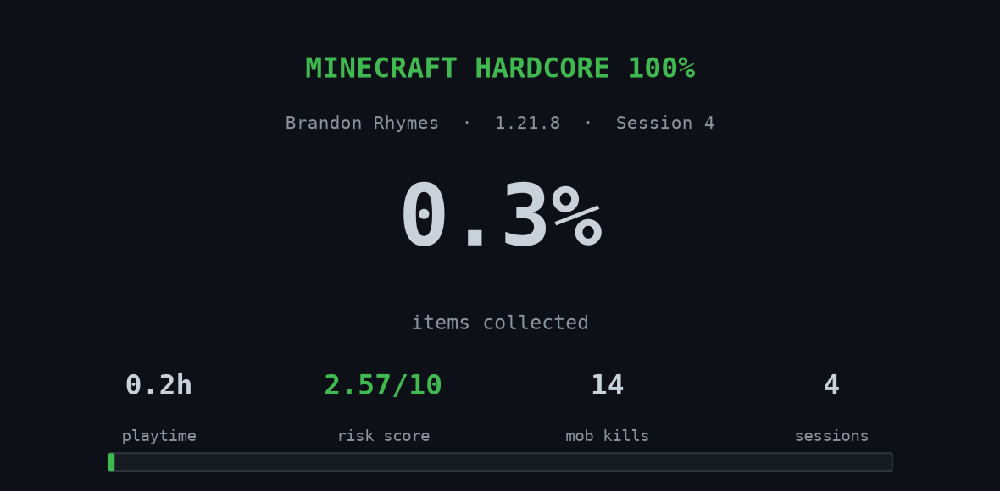
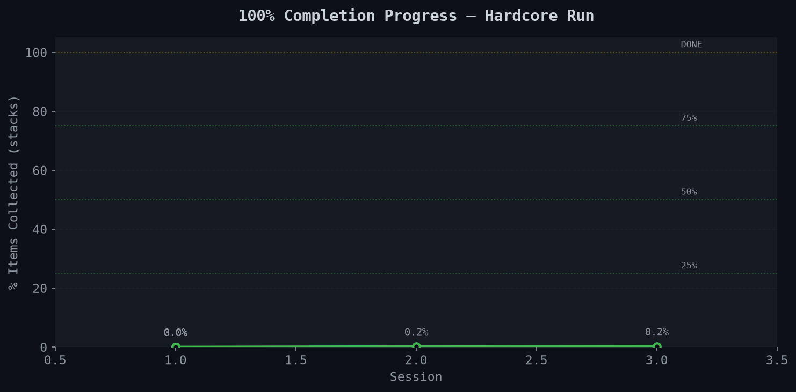
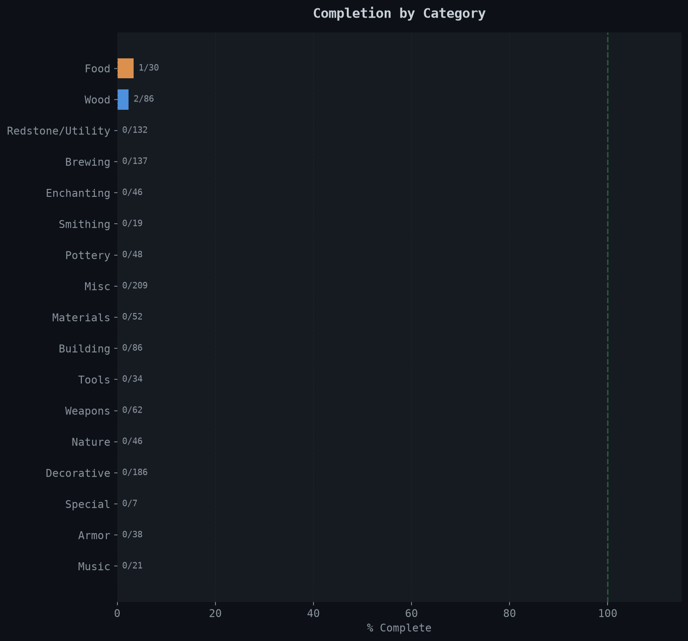
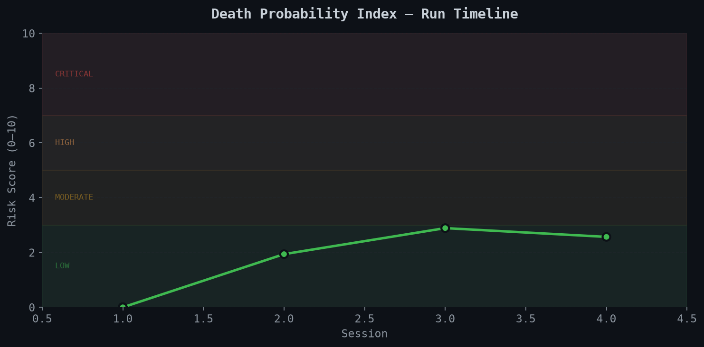
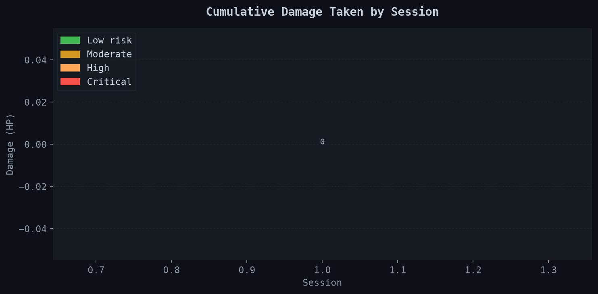

# 🎮 Minecraft Hardcore 100% — Live Data Tracker

> **One life. Every item. A stack of each.**  
> This repo tracks a Minecraft Java Edition 1.21.8 hardcore 100% completion run  
> using Python analytics on the game's native stats JSON. No mods. No cheats. One death and it's over.

---

## 📊 Run Status

<!-- UPDATE THESE AFTER EACH SESSION by running: python src/dashboard.py -->

| Stat | Value |
|------|-------|
| 🗓️ Version | Java Edition 1.21.8 |
| ⚡ Status | **ALIVE** |
| 📦 Completion | 0.0% |
| 🎲 Risk Score | 0.0 / 10 |
| ⏱️ Playtime | 0h |
| 🔢 Session | 0 |



---

## 📈 Progress Charts

### Overall Completion


### Category Breakdown


### Death Probability Index


### Damage Taken Per Session


---

## 🧠 What This Project Is

Most Minecraft 100% runs are documented with screenshots and vibes.  
This one is documented with **data**.

Minecraft saves a `stats/<uuid>.json` file that tracks everything — blocks mined, mobs killed, damage taken, items crafted, distance walked, time slept. Every session, I run a Python script that:

1. Reads the stats JSON
2. Cross-references it against a master item list (~400+ items in 1.21.8)
3. Calculates completion % per category
4. Computes a **Death Probability Index (DPI)** — a composite risk score
5. Saves a session snapshot and updates the charts above

The run ends when I either collect a stack of every obtainable survival item — or die.

---

## 🎲 The Death Probability Index (DPI)

The DPI is a composite risk score (0–10) calculated each session from:

| Component | Weight | What it measures |
|-----------|--------|-----------------|
| Damage rate | 30% | HP taken per hour of play |
| High-risk mob exposure | 30% | Weighted encounters with dangerous mobs |
| Sleep debt | 20% | Phantom risk proxy — time since last sleep |
| Completion pressure | 20% | Higher completion = riskier areas required |

```
DPI = (damage_rate × 0.3) + (risk_exposure × 0.3) + (sleep_debt × 0.2) + (completion_pct × 0.2)
```

A DPI of 7+ means I'm in dangerous territory. The chart above shows it over time.  
If this run ends in death, the DPI will have predicted it.

---

## 📁 Repo Structure

```
minecraft-hardcore-100/
│
├── README.md                    ← you are here
├── data/
│   ├── items_required.csv       ← master list: all ~400+ items, categories, stack sizes
│   ├── run_log.csv              ← session-by-session summary (auto-generated)
│   └── sessions/                ← raw stats JSON snapshots, one per session
│
├── src/
│   ├── parse_stats.py           ← reads MC stats JSON → dataframes + session log
│   ├── dashboard.py             ← generates all charts from run_log.csv
│   └── risk_score.py            ← DPI formula (standalone, for reference)
│
├── notebooks/
│   └── analysis.ipynb           ← exploratory analysis for the YouTube video
│
├── outputs/
│   └── charts/                  ← auto-generated PNGs for this README
│
└── docs/
    └── methodology.md           ← full DPI formula documentation
```

---

## 🚀 Run It Yourself

```bash
# Clone
git clone https://github.com/brandon-rhymes/minecraft-hardcore-100
cd minecraft-hardcore-100

# Install dependencies
pip install matplotlib numpy pandas

# After a play session, parse your stats:
python src/parse_stats.py \
  --stats "~/.minecraft/saves/HardcoreRun/stats/<your-uuid>.json" \
  --session 1

# Regenerate charts
python src/dashboard.py
```

**Finding your stats file:**
- **Windows:** `%appdata%\.minecraft\saves\<WorldName>\stats\<uuid>.json`
- **Mac:** `~/Library/Application Support/minecraft/saves/<WorldName>/stats/<uuid>.json`
- **Linux:** `~/.minecraft/saves/<WorldName>/stats/<uuid>.json`

---

## 📋 Item Categories

| Category | Items | Notes |
|----------|-------|-------|
| Building | ~100 | Ores, blocks, wood types |
| Nature | ~80 | Plants, flowers, mushrooms — includes 1.21.5 additions |
| Food | ~50 | All food items including new eggs |
| Tools | ~45 | All tiers + special tools |
| Weapons | ~15 | Swords, bows, trident, mace (1.21) |
| Armor | ~25 | All tiers including wolf armor |
| Materials | ~60 | Resources, drops, gems |
| Redstone | ~25 | Including Crafter block (1.21) |
| Brewing | ~25 | Potions |
| Music | ~17 | All discs including Tears (1.21.6) |
| Utility | ~30 | Functional blocks |

> **Hardest items:** Enchanted Golden Apple (chest-only, no crafting), Dragon Egg (1 per world), Music Disc 5 (9 fragments from Ancient City), Happy Ghast items (1.21.6), Nether Star (kill the Wither — in hardcore).

---

## 🎬 YouTube Video

This run will become a long-form YouTube video on **[NovaNet]**.  
The data is the narrative. Every chart in this repo is a scene in the film.

**Rough structure:**
- **Act 1:** What is 100% Minecraft actually? The math of the item list.
- **Act 2:** The data story — session by session, what the numbers said.
- **Act 3:** The hardest items — told through the data.
- **Act 4:** The psychology of decision-making under permanent death.
- **Close:** What the DPI said before everything went right — or wrong.

---

## 📝 Session Log

| Session | Date | Hours | Completion | Risk | Notes |
|---------|------|-------|------------|------|-------|
| — | — | — | 0% | — | Run not started |

*Updated automatically by `run_log.csv` — session notes added manually.*

---

*B.Sc. Biopsychology — Acadia University 2024 · Data Analytics cert in progress*  
*This project is part of a public data analytics portfolio.*
